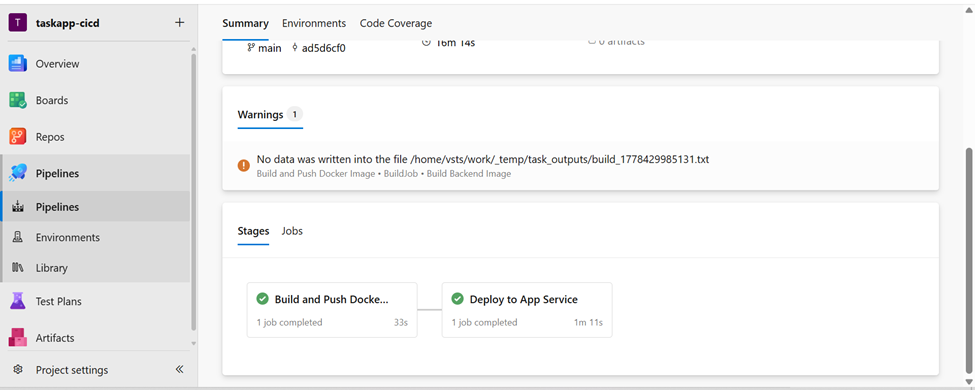

# Taskify - A Team Collaboration Tool 

## Full Stack Project using MERN

# Overview
The Cloud-Based Task Manager is a web application designed to streamline team task management. Built using the MERN stack (MongoDB, Express.js, React, and Node.js), this platform provides a user-friendly interface for efficient task assignment, tracking, and collaboration. The application caters to administrators and regular users, offering comprehensive features to enhance productivity and organization.

### Why/Problem?
In a dynamic work environment, effective task management is crucial for team success. Traditional methods of task tracking through spreadsheets or manual systems can be cumbersome and prone to errors. The Cloud-Based Task Manager aims to address these challenges by providing a centralized platform for task management, enabling seamless collaboration and improved workflow efficiency.

### **Background**:
With the rise of remote work and dispersed teams, there is a growing need for tools that facilitate effective communication and task coordination. The Cloud-Based Task Manager addresses this need by leveraging modern web technologies to create an intuitive and responsive task management solution. The MERN stack ensures scalability, while the integration of Redux Toolkit, Headless UI, and Tailwind CSS enhances user experience and performance.

### 
## **Admin Features:**
1. **User Management:**
    - Create admin accounts.
    - Add and manage team members.

2. **Task Assignment:**
    - Assign tasks to individual or multiple users.
    - Update task details and status.

3. **Task Properties:**
    - Label tasks as todo, in progress, or completed.
    - Assign priority levels (high, medium, normal, low).
    - Add and manage sub-tasks.

4. **Asset Management:**
    - Upload task assets, such as images.

5. **User Account Control:**
    - Disable or activate user accounts.
    - Permanently delete or trash tasks.

## **User Features:**
1. **Task Interaction:**
    - Change task status (in progress or completed).
    - View detailed task information.

2. **Communication:**
    - Add comments or chat to task activities.

## **General Features:**
1. **Authentication and Authorization:**
    - User login with secure authentication.
    - Role-based access control.

2. **Profile Management:**
    - Update user profiles.

3. **Password Management:**
    - Change passwords securely.

4. **Dashboard:**
    - Provide a summary of user activities.
    - Filter tasks into todo, in progress, or completed.

## **Technologies Used:**
- **Frontend:**
    - React (Vite)
    - Redux Toolkit for State Management
    - Headless UI
    - Tailwind CSS

- **Backend:**
    - Node.js with Express.js
    
- **Database:**
    - MongoDB for efficient and scalable data storage.

The Cloud-Based Task Manager is an innovative solution that brings efficiency and organization to task management within teams. By harnessing the power of the MERN stack and modern frontend technologies, the platform provides a seamless experience for both administrators and users, fostering collaboration and productivity.

&nbsp;

# DevOps Lab Submission: Taskify MERN CI/CD

##  Live Links
- Frontend (Static Web App): [https://gray-coast-0b1b2d300.7.azurestaticapps.net/log-in]
- Backend API: https://app-taskapp-backend-raza.azurewebsites.net/api/tasks

## 🛠️ Project Evidence

### 1. Successful Multi-Stage Pipeline
[Pipeline Proof]([])
Proof of successful Build and DeployProd stages in Azure DevOps.

### 2. Azure Container Registry (ACR) Repositories
])
Backend images successfully pushed with automated build tags.

### 3. Database Schema
])
Azure SQL Database is online with populated schema tables.

## 🔒 Security & Best Practices
- No Secrets: All sensitive strings (DB passwords, registry credentials) are stored in Azure DevOps Variable Groups.
- GitIgnore: `.env` files are ignored to prevent credential leakage.